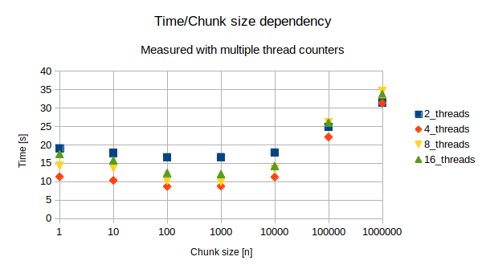
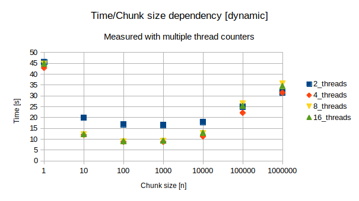
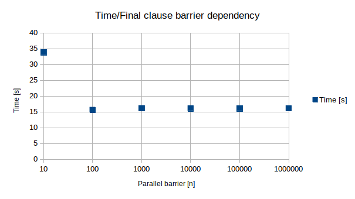
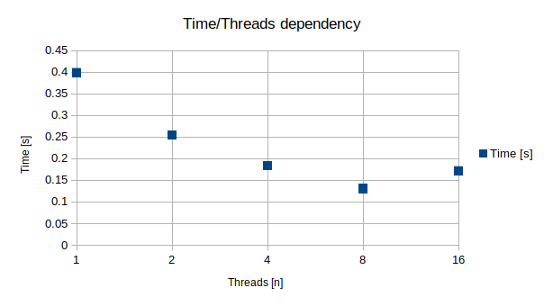

# Praktikum I

## Aufgabe 1
### Quellcodeverzeichnis
| Teilaufgabe | Verzeichnis        | Quellcode       | Compile command | Execute command                |
|-------------|--------------------|-----------------|-----------------|--------------------------------|
| A           | `Exercise1/TaskA/` | `task-a.c`      | `make`          | `./taska <amount> <chunksize>` |
| B           | `Exercise1/TaskB/` | `task-b.c`      | `make`          | `./taskb <amount> <chunksize>` |
| C           | `Exercise1/TaskB/` | `task-b.c`      | `make`          | `./run-tests.sh`               |
| D           | `Exercise1/TaskD/` | `task-d.c`      | `make`          | `./taskd <amount> <chunksize>` |

### Weiterführende Erklärungen
#### Teilaufgabe C

Zunächst einmal ist festzustellen, dass die gemessenen Laufzeiten unabhängig der Chunksizes bei threads=4 konsistent am kürzesten waren, was mit der Anzahl der genutzten CPU-Cores zusammenhängt. Bei 4 Threads/Cores wird im Optimalfall jedem Core ein Thread zugewiesen, sodass unnötiger Overhead bei etwaigem Threadwechsel entfällt. Die mit nur 2 Threads durchgeführten Berechnungen waren stets am langsamsten, da die hier nicht alle Cores parallel genutzt werden können. Die mit 8 bzw. 16 Threads erzielten Ergebnisse ordnen sich zwischen diesen beiden Extremen ein, was mit zuvor genanntem Overhead erklärbar ist.

Im Bezug auf Chunksizes überwiegt bei sehr kleinen Größen (< 100) der Overhead, während bei sehr großen Chunks (> 10.000) nicht optimal parallelisiert werden kann. Damit liegt die optimale Ausführungszeit bei Chunksizes um 100-1.000. 

#### Teilaufgabe D

Im Großen und Ganzen treffen die Erkenntnisse aus Aufgabe C auch auf Teilaufgabe D zu, mit dem Unterschied des drastisch angestiegenen Overheads. Gerade bei sehr kleinen Chunksizes (z.B. 1) wird das besonders deutlich, da die Ausführungszeit hier sowohl im Vergleich zu größeren Chunks als auch generell statischen Chunks aus dem Rahmen fällt. Darüber hinaus wird die Zeitspanne zwischen 4, 8 und 16 Threads minimiert, was wieder auf den größeren Anteil des Overheads an der Ausführungszeit zurückzuführen ist.

## Aufgabe 2
### Quellcodeverzeichnis
| Teilaufgabe | Verzeichnis        | Quellcode       | Compile command | Execute command                |
|-------------|--------------------|-----------------|-----------------|--------------------------------|
| A           | `Exercise2/TaskA/` | `task_a.c`      | `make`          | `./task_a <array_length>`      |
| B           | `Exercise2/TaskB/` | `task_b.c`      | `make`          | `./task_b <array_length>`      |
| C           | `Exercise2/TaskC/` | `task_c.c`      | `make`          | `./run-tests.sh`               |

### Weiterführende Erklärungen
#### Teilaufgabe C

[TODO Erklärungen für final clause]

## Aufgabe 3

Aufgabe 3 a)

sum: In zeile 11 gibt es bei result eine Flow-Dependence

shift: Zeile 20 bei a[i] (bzw. a[i+offeset] eine Anti-Dependence

hash: Bei hash in Zeile 36,38,42 und 44 eine Flow-Dependence

init: keine iterationsübergreifenden Datenabhängigkeiten

## Aufgabe 4

## a)

* count : shared
* val : shared
* g : shared
* *g : private

## b)

* count : shared
* val : private
* cnt : private
* res : private
* *res : private
* i : shared
* j : private
* a : shared

## Aufgabe 5
### Quellcodeverzeichnis
| Teilaufgabe | Verzeichnis        | Quellcode       | Compile command | Execute command                                     |
|-------------|--------------------|-----------------|-----------------|-----------------------------------------------------|
| A + B       | `Exercise5/TaskB/` | `task-b.cpp`    | `make`          | `./taskb <xmin> <xmax> <ymin> <ymax> <maxIter>`     |
| C           | `Exercise5/TaskC/` | `task-c.cpp`    | `make`          | `./run-tests.sh`                                    |

### Weiterführende Erklärungen
#### Teilaufgabe C

